# Laboratorio · ReservApp · Identidad, autorización e IDaaS

**Duración sugerida:** 60–90 minutos, divisible entre bloques de la semana.  
**Modalidad:** grupos de máximo 3 integrantes.  
**Prerequisito:** comprender el laboratorio de API Gateway de Semana 01.

Este laboratorio integra **1.2.1 a 1.2.4** sobre una aplicación real de laboratorio. No se queda solo en diagramas: deben **levantar ReservApp, ejecutar el flujo, provocar errores y explicar qué componente toma cada decisión**.

> ReservApp es el dominio formativo transversal de DSY1107. No corresponde al dominio de las evaluaciones sumativas.

> El `mock-identity` es un **simulador didáctico**, no un proveedor OAuth2/OIDC real. Sus tokens no son JWT reales y su código no debe reutilizarse como seguridad de producción.

---

## 1. Starter ejecutable

Usen la aplicación incluida en:

[`starter/`](./starter/README.md)

La arquitectura es:

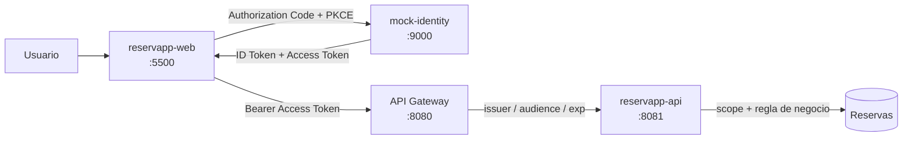

Antes de avanzar, cada integrante debe poder identificar:

- Resource Owner;
- Client;
- Authorization Server / IdP;
- Resource Server;
- API Gateway.

---

# Etapa A · Levantar y reconocer la aplicación

Sigan las instrucciones de [`starter/README.md`](./starter/README.md) y levanten:

1. `mock-identity` en `9000`;
2. `reservapp-api` en `8081`;
3. `gateway` en `8080`;
4. `client` en `5500`.

No modifiquen código todavía.

## Instrucciones de ejecución

**Requisitos:** Java 21, Maven 3.9+, Python 3 (para servir el cliente) y un navegador moderno.

Cada componente va en su **propia terminal**, y hay que respetar el orden (cada uno debe decir `Started` antes de lanzar el siguiente):

```bash
# Terminal 1 · IdP simulado -> http://localhost:9000
cd starter/mock-identity
mvn spring-boot:run

# Terminal 2 · Resource Server -> http://localhost:8081
cd starter/reservapp-api
mvn spring-boot:run

# Terminal 3 · API Gateway -> http://localhost:8080
cd starter/gateway
mvn spring-boot:run

# Terminal 4 · Cliente web -> http://localhost:5500
cd starter/client
py -m http.server 5500
```

Luego abrir en el navegador:

```text
http://localhost:5500/index.html
```

> La URL importa: el IdP simulado solo reconoce `http://localhost:5500/index.html` como `redirect_uri` registrada. Si se sirve el cliente en otro puerto o ruta, el flujo se rechaza (lo comprobamos en la Etapa K).

> En Windows, si `python` no se reconoce como comando, usar `py` como en el ejemplo. En Linux/macOS corresponde `python3`.

## Evidencia

En el README del grupo registren:

- los cuatro componentes levantados;

    - mock-identity:

        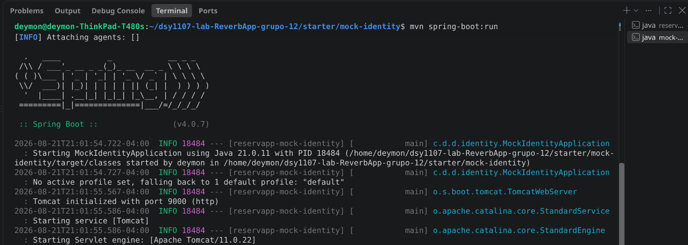

    - reservapp-api:

        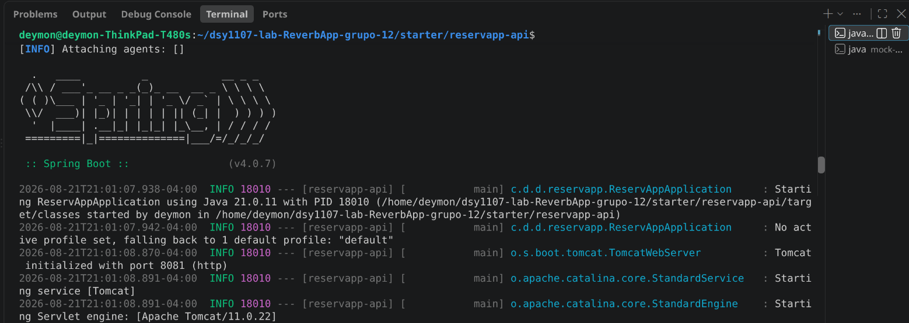

    - gateway:

        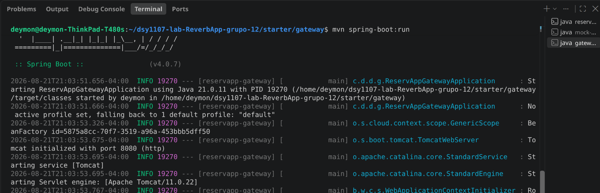

    - client:

        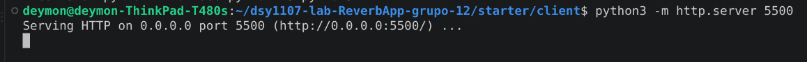

- qué rol conceptual cumple cada uno;

    - mock-identity: actúa como el Authorization Server / IdP (autentica usuarios y emite tokens)
    - reservapp-api: actúa como el Resource Server (expone el recurso protegido; valida scope y reglas de negocio)
    - gateway: es donde se aplica la política transversal (valida issuer/audience/exp antes del backend)
    - client: Client OAuth2 público que inicia el flujo y recibe los tokens

- una captura o salida que demuestre que ReservApp está operativa.

    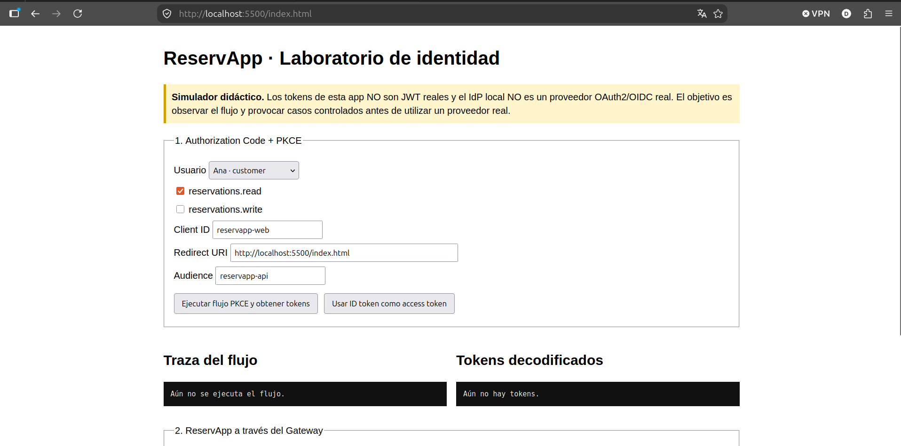

    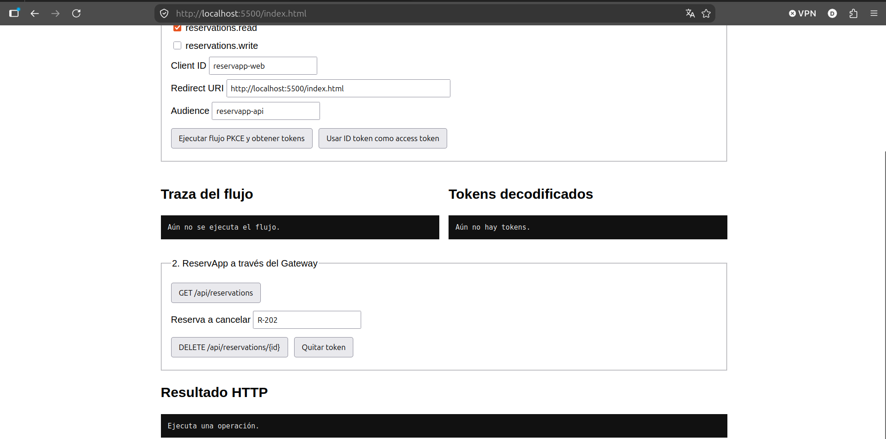

---

# Etapa B · “Continuar con Google” vs “Conectar Google Drive”

Antes de probar ReservApp, relacionen el laboratorio con algo cotidiano.

### Caso 1 · Continuar con Google

Una aplicación permite reconocer al usuario usando su identidad Google.

Preguntas:

1. ¿La aplicación recibe la contraseña de Google?

    - R: No. La contraseña se escribe únicamente en el sitio de Google, que es quien autentica al usuario. La aplicación nunca la ve: solo recibe de vuelta un token.

2. ¿Qué problema principal estamos resolviendo?

    - R: Evitar que cada aplicación tenga que manejar contraseñas por su cuenta. En vez de crear y custodiar credenciales propias, se delega la autenticación en un proveedor que ya lo hace bien y de forma segura.

3. ¿Qué papel cumple Google?

    - R: Actúa como el Authorization Server / IdP: autentica al usuario y emite los tokens.

4. ¿Cómo se relaciona este caso con OIDC?

    - R: OIDC es la capa de identidad que se monta sobre OAuth2. Es la que entrega el ID Token, y gracias a eso la app puede saber quién se autenticó, no solo qué permisos tiene.


### Caso 2 · Conectar Google Drive

El usuario ya inició sesión, pero ahora una aplicación desea abrir o guardar archivos en Drive.

Preguntas:

1. ¿El login anterior entrega automáticamente acceso al Drive?

    - R: No. El login anterior solo autentica al usuario; los archivos de Drive son otro recurso protegido no cubierto por ese login directamente.

2. ¿Qué recurso protegido aparece ahora?

    - R: Los archivos del usuario en Google Drive; su API actúa como otro Resource Server.

3. ¿Por qué hace falta autorización adicional?

    - R: Porque son recursos y scopes distintos; el usuario debe dar consentimiento a ese acceso.

4. ¿Cómo se relaciona este caso con OAuth2?

    - R: OAuth2 se encarga de toda la autorización y da acceso limitado a algunos recursos por medio de los scopes.


Conclusión esperada:

```text
reconocer quién eres ≠ obtener permiso para usar otro recurso
```

---

# Etapa C · Ejecutar Authorization Code + PKCE

En `reservapp-web` mantengan inicialmente:

```text
client_id    = reservapp-web
redirect_uri = http://localhost:5500/index.html
audience     = reservapp-api
scope        = reservations.read
```

Pulsen **Ejecutar flujo PKCE y obtener tokens**.

Observen la traza y ubiquen:

1. `code_verifier`;

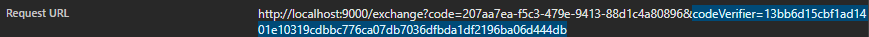

2. `code_challenge`;

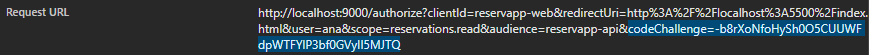

3. Authorization Request;

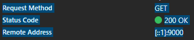

4. `client_id`;

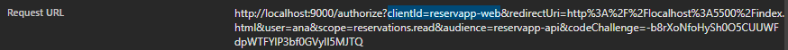

5. `redirect_uri`;

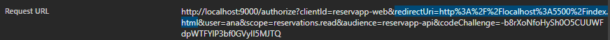

6. Authorization Code;

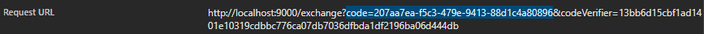

7. intercambio Code + verifier;

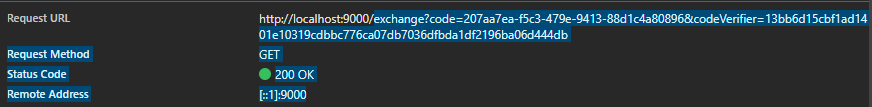

8. ID Token;

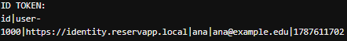

9. Access Token.

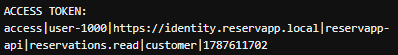

Luego dibujen el flujo que realmente observaron:

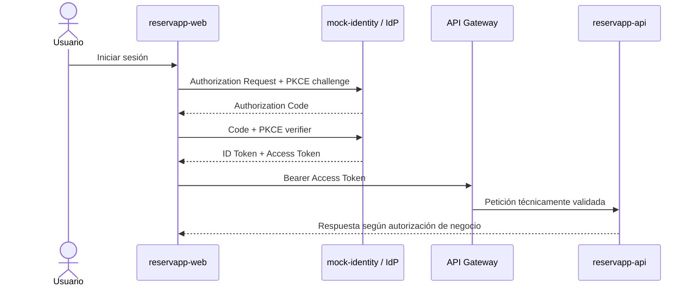

## Preguntas

- ¿Por qué `Client ID` no es una contraseña?

    - R: Porque es información pública: viaja en texto plano dentro de la URL y cualquiera puede verla. Su función es solo identificar qué aplicación está iniciando el flujo (`reservapp-web`), no demostrar que esa aplicación sea legítima. Es un nombre, no un secreto.

- ¿Por qué la redirect URI debe estar registrada?

    - R: Porque es la dirección a la que se envía el Authorization Code. El Authorization Server compara la URI recibida contra la registrada previamente y, si no coinciden, rechaza el flujo. Sin esa validación, un atacante podría pedir un login legítimo pero desviar el código hacia un servidor propio.

- ¿Qué intenta proteger PKCE?

    - R: Protege el Authorization Code frente a que alguien lo intercepte en el camino. Aunque un atacante logre robar el código, no puede canjearlo por tokens, porque para eso hace falta el `code_verifier` original, que nunca salió del navegador que inició el flujo.

- ¿Por qué una SPA se considera cliente público?

    - R: Porque todo su código se ejecuta en el navegador del usuario. No tiene un backend propio donde guardar secretos, así que cualquier cosa que se le entregue queda expuesta.

- ¿Por qué no colocaríamos un client secret en JavaScript frontend?

    - R: Porque cualquier usuario puede abrir las herramientas del navegador y leer el código fuente. El secreto quedaría a la vista y dejaría de ser secreto: cualquiera podría suplantar a la aplicación. Por eso las SPA usan PKCE en lugar de un client secret.

---

# Etapa D · Access Token vs ID Token

Después del login observen ambos tokens decodificados.

Identifiquen en el **Access Token didáctico**: access|user-1000|https://identity.reservapp.local|reservapp-api|reservations.read|customer|1787613973

```text
sub:   user-1000                          (identificador único del usuario en el sistema)
iss:   https://identity.reservapp.local   (quién emitió el token, en este caso mock-identity)
aud:   reservapp-api                      (para quién va dirigido el token, el Resource Server)
scope: reservations.read                  (los permisos concedidos)
role:  customer                           (el rol del usuario dentro del negocio)
exp:   1787613973                         (timestamp que indica cuándo caduca el token)
```

Luego pulsen:

**Usar ID token como access token**

y ejecuten:

```text
GET /api/reservations
```

Registren:

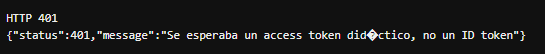

```json
HTTP 401
{"status":401,"message":"Se esperaba un access token didáctico, no un ID token"}
```

- **Status HTTP:** 401 Unauthorized

- **Componente que rechaza la petición:** el API Gateway.

- **Motivo:** el Gateway revisa el token antes de dejarlo pasar al backend, y lo primero que valida es el **tipo de token**: espera uno que empiece con `access`. El ID Token no lo es, así que lo rechaza de inmediato. Ni siquiera alcanza a revisar issuer, audience o expiración, porque falla en el primer control.

- **Diferencia de propósito entre ambos tokens:**

    - **ID Token:** es como el carnet de identidad. Sirve para que el Client sepa quién se autenticó (mostrar el nombre, la foto). No sirve para pedirle nada a la API.
    - **Access Token:** es como la llave de un edificio. Se presenta ante el recurso protegido para demostrar qué se tiene permitido hacer. No le importa quién eres, sino qué puedes hacer.

Deben poder explicar:

```text
ID Token     → informa al Client quién se autenticó
Access Token → se presenta ante el recurso protegido
```

---

# Etapa E · Scopes y mínimo privilegio

## Prueba E1 · Solo lectura

Autentíquense como **Ana** con:

```text
reservations.read
```

Ejecuten:

```text
GET /api/reservations
```

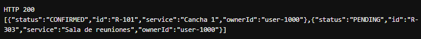

Luego intenten:

```text
DELETE /api/reservations/R-101
```

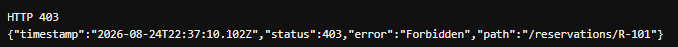

Respondan:

- ¿por qué una operación funciona y la otra no?;

    - R: El GET funciona (HTTP 200) porque el Access Token incluye explícitamente el permiso para leer (`reservations.read`). El DELETE falla (HTTP 403) porque `reservapp-api` revisa los scopes del token antes de ejecutar la acción y detecta que ese permiso de escritura no fue concedido.

- ¿qué scope falta?;

    - R: Falta `reservations.write`.

- ¿por qué no conviene pedir `reservations.write` si solo necesitamos consultar?

    - R: Por el principio de mínimo privilegio. Una aplicación solo debe pedir los permisos estrictamente necesarios para lo que va a hacer. Si pide escritura y no la usa, un token robado o un bug podrían borrar datos que nunca se necesitó tocar.

## Prueba E2 · Lectura y escritura

Repitan el login agregando:

```text
reservations.write
```

Intenten cancelar `R-101`.

Registren el resultado.

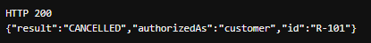

```json
HTTP 200
{"result":"CANCELLED","authorizedAs":"customer","id":"R-101"}
```

Con el scope agregado, la misma operación que antes daba 403 ahora se ejecuta. No cambió el usuario ni la reserva: lo único que cambió fue el permiso solicitado en el login.

---

# Etapa F · 401: fallos de autenticación/validación técnica

Ejecuten cada escenario por separado.

## F1 · Sin token

Pulsen **Quitar token** y consulten reservas.

## F2 · Audience incorrecta

Antes del login cambien:

```text
reservapp-api
```

por:

```text
otra-api
```

## F3 · ID token enviado a la API

Obtengan tokens válidos y luego usen el ID token como Bearer token.

Para cada caso indiquen:

```text
status HTTP
componente que rechaza
qué validación falló
por qué no corresponde continuar al backend
```

## Resultados obtenidos

### F1 · Sin token

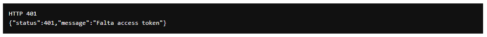

```json
HTTP 401
{"status":401,"message":"Falta access token"}
```

- **Status:** 401 Unauthorized
- **Componente que rechaza:** el API Gateway
- **Validación que falló:** no venía la cabecera `Authorization: Bearer ...`
- **Por qué no continúa al backend:** sin token no hay forma de saber quién pide ni qué permisos tiene. El Gateway corta acá para que la API nunca reciba peticiones anónimas.

### F2 · Audience incorrecta

Configuración usada antes del login (`audience = otra-api`):

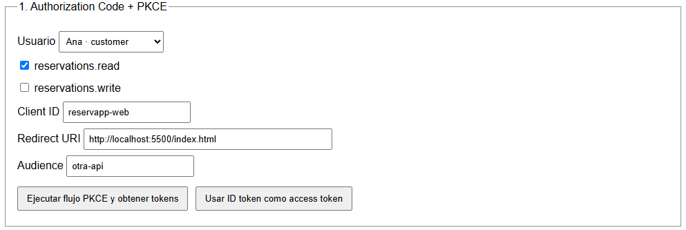

Resultado al llamar la API:

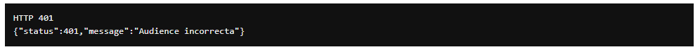

```json
HTTP 401
{"status":401,"message":"Audience incorrecta"}
```

- **Status:** 401 Unauthorized
- **Componente que rechaza:** el API Gateway
- **Validación que falló:** el token venía con `aud=otra-api`, pero el Gateway espera `reservapp-api`
- **Por qué no continúa al backend:** el token es auténtico, pero fue emitido para otro destinatario. Aceptarlo permitiría reutilizar en ReservApp un token pensado para otra API.

### F3 · ID token enviado a la API

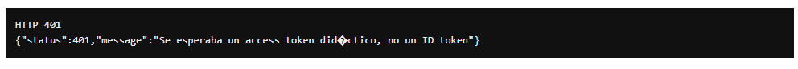

```json
HTTP 401
{"status":401,"message":"Se esperaba un access token didáctico, no un ID token"}
```

- **Status:** 401 Unauthorized
- **Componente que rechaza:** el API Gateway
- **Validación que falló:** el tipo de token. El Gateway revisa que el token empiece con `access` y el ID Token no lo hace
- **Por qué no continúa al backend:** el ID Token está dirigido al cliente, no a la API. No transporta scopes, así que la API no tendría con qué decidir permisos.

## Relación con los cuatro conceptos

El Gateway valida en este orden y con el primer fallo corta:

| Validación | Qué revisa | Caso que lo dispara |
|---|---|---|
| **Tipo de token** | que sea `access`, no un ID Token | F3 |
| **Issuer** | que lo haya emitido `https://identity.reservapp.local` | (token de otro IdP) |
| **Audience** | que el `aud` sea `reservapp-api` | F2 |
| **Expiración** | que `exp` esté en el futuro | (token vencido) |

Los tres casos dieron 401 porque todos son fallos de **autenticación/validación técnica**: el Gateway no logra confiar en el token. Ninguno llegó siquiera a `reservapp-api`.

> El simulador no incluye un botón para adelantar el reloj. Expliquen qué ocurriría cuando `exp` quede en el pasado.

**R:** El Gateway compararía `exp` contra la hora actual y devolvería `401 Token expirado`. Pasaría exactamente lo mismo que en F1–F3: se corta antes del backend. El token seguiría siendo auténtico y con los scopes correctos, pero ya no es válido — los tokens caducan justo para que uno robado no sirva para siempre. La solución en un sistema real sería pedir un token nuevo (refresh token o volver a loguearse).

---

# Etapa G · 403 por autorización técnica

Autentíquense como **Ana** solo con:

```text
reservations.read
```

e intenten cancelar una reserva.

El token es válido, pero no posee la capacidad requerida.

Respondan:

- ¿por qué esto no es igual al caso “sin token”?;

    - R: Porque acá sí hay token y sí es válido. Ana está autenticada, solo que no tiene permiso para borrar, es un problema de permisos, no de identidad.

- ¿qué diferencia conceptual existe entre 401 y 403?;

    - R: 401 es "no sé quién eres" (falta o falla el token). 403 es "ya sé quién eres, pero no puedes hacer esto".

- ¿qué componente toma la decisión por scope en esta implementación?

    - R: reservapp-api (el backend), no el Gateway. El Gateway solo valida que el token sea técnicamente correcto (issuer/audience/exp); quién puede hacer qué lo decide la API.

**Resultado obtenido:**

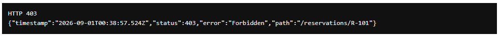

```json
HTTP 403 Forbidden
{"timestamp":"2026-09-01T00:38:57.524Z","status":403,"error":"Forbidden","path":"/reservations/R-101"}
```

---

# Etapa H · 403 por autorización de negocio

Autentíquense como **Ana** con:

```text
reservations.read reservations.write
```

Intenten cancelar:

```text
R-202
```

Esa reserva pertenece a Bruno.

Luego cancelen:

```text
R-101
```

Respondan:

1. ¿por qué el scope `reservations.write` no basta para cancelar cualquier reserva?;

    - R: Porque el scope solo dice "puede escribir/cancelar", pero no dice de quién. Es como tener llave de "puedo abrir puertas", pero eso no significa que puedas entrar a la casa de otra persona.

2. ¿qué dato del token identifica al sujeto?;

    - R: El `sub` (en este caso `user-1000`, que es Ana).

3. ¿qué dato del dominio debe compararse con ese sujeto?;

    - R: El dueño de la reserva (`ownerId`). Si no coinciden, no se puede tocar esa reserva.

4. ¿por qué esta validación pertenece al backend y no solamente al Gateway?

    - R: Porque el Gateway no sabe nada de las reservas ni de quién es cada una, solo valida el token. Esa comparación (dueño vs quien pide) es una regla de negocio, y eso vive en la API.

**Resultados obtenidos:**

- Ana intenta cancelar `R-202` (de Bruno) → rechazado:

    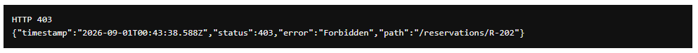

    ```json
    HTTP 403 Forbidden
    {"timestamp":"2026-09-01T00:43:38.588Z","status":403,"error":"Forbidden","path":"/reservations/R-202"}
    ```

- Ana cancela `R-101` (propia) → permitido:

    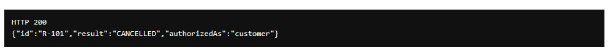

    ```json
    HTTP 200
    {"id":"R-101","result":"CANCELLED","authorizedAs":"customer"}
    ```

Dibujen la decisión:

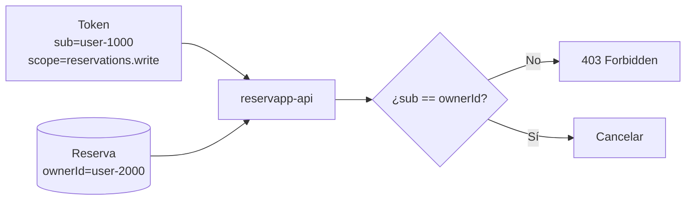

---

# Etapa I · Roles: customer vs operator

Repitan la prueba anterior como **Operador**, con lectura y escritura.

Comparen el resultado.

Expliquen:

- qué representa `role=operator`;

    - R: Es un "cargo" dentro del sistema, alguien con más confianza que un cliente normal (como un admin/soporte que puede gestionar reservas de cualquier usuario).

- por qué un role no es lo mismo que un scope;

    - R: El scope dice QUÉ acción puedes hacer (leer, escribir). El role dice QUIÉN eres dentro del negocio, y eso puede darte permisos extra que el scope solo no te da (ej: saltarte la regla de "solo mis reservas").

- qué ocurriría si un operador tuviera role correcto pero no `reservations.write`.

    - R: Igual le rechazarían con 403, porque el código valida el scope ANTES de mirar el rol. Sin `reservations.write` no llega ni a la validación de dueño (esto lo comprobamos en la prueba real, ver abajo).

**Resultado obtenido:**

Ana (customer) intentando `R-202` → 403 (ver Etapa H). Operador con `reservations.read reservations.write` intentando `R-202` → permitido:

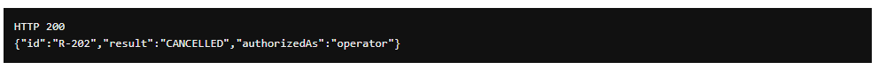

```json
HTTP 200
{"id":"R-202","result":"CANCELLED","authorizedAs":"operator"}
```

Mismo scope que Ana, mismo intento, distinto resultado — la diferencia es solo el rol.

---

# Etapa J · Tenant, IDaaS y CIAM sobre la app que está corriendo

Ahora mapeen el sistema ejecutado a los conceptos de las guías.

Creen `tenant-design.md` con:

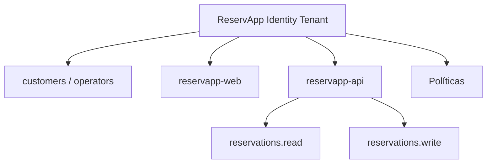

Respondan:

- ¿qué está simulando `mock-identity`?;
- ¿qué capacidades reales esperaremos de un IDaaS?;
- ¿por qué ReservApp corresponde a un escenario cercano a CIAM para clientes externos?;
- ¿un usuario del IdP debe ser exactamente la misma entidad que `Cliente` en la base de datos de ReservApp?;
- ¿qué significa que el tenant sea una frontera de confianza?

> Las respuestas de esta etapa están desarrolladas en [`tenant-design.md`](./tenant-design.md), junto con el diagrama del tenant.

---

# Etapa K · App registration

Creen `app-registration-design.md` usando lo observado en el starter.

## `reservapp-web`

```text
Rol: Client
Tipo: público
Client ID: reservapp-web
Redirect URI: http://localhost:5500/index.html
Flujo: Authorization Code + PKCE
Scopes: reservations.read / reservations.write
Client secret: no
```

## `reservapp-api`

```text
Rol: Resource Server
Issuer esperado: https://identity.reservapp.local
Audience esperada: reservapp-api
Scopes: reservations.read / reservations.write
```

### Pruebas obligatorias

1. Cambien `client_id` a un valor no registrado y ejecuten login.
2. Restáurenlo.
3. Cambien `redirect_uri` y ejecuten login.
4. Restáurenla.

Para cada prueba indiquen **en qué momento falla el flujo**. No intenten convertir estos errores artificialmente en 401/403 de la API: ocurren antes de llamar a `reservapp-api`.

---

# Etapa L · Arquitectura final

Construyan un Mermaid final que reúna lo ejecutado durante la semana:

- usuario;
- `reservapp-web`;
- tenant / IdP / IDaaS;
- Authorization Code + PKCE;
- ID Token;
- Access Token;
- `client_id`;
- redirect URI;
- issuer;
- audience;
- scopes;
- role;
- API Gateway;
- `reservapp-api`;
- datos de negocio;
- validación técnica;
- autorización por scope;
- autorización de negocio.

El diagrama debe permitir explicar de extremo a extremo una petición real que ustedes hayan ejecutado.

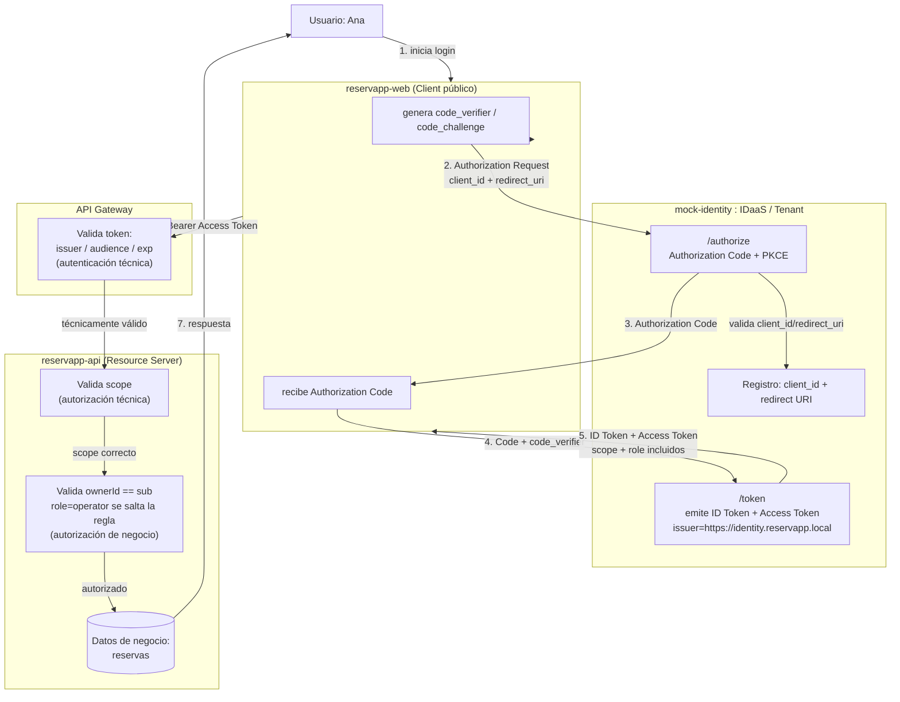

**Cómo leerlo con una petición real (Etapa H, Ana cancela `R-101`):**

1. Ana hace login → `reservapp-web` genera PKCE y manda `client_id=reservapp-web` + `redirect_uri` al IdP.
2. El IdP valida que esa app y esa URI estén registradas → devuelve Authorization Code.
3. `reservapp-web` intercambia el Code + verifier → recibe ID Token y Access Token (con `scope=reservations.write`, `role=customer`, `sub=user-1000`).
4. La web llama a la API con el Access Token como Bearer.
5. El Gateway valida issuer/audience/exp (técnico) → pasa.
6. La API valida el scope `reservations.write` (técnico) → pasa.
7. La API compara `sub` con el `ownerId` de `R-101` → coinciden → autoriza y cancela (negocio).

---

# Entrega mínima

El repositorio grupal debe contener:

```text
README.md
tenant-design.md
app-registration-design.md
```

El `README.md` debe incluir:

- instrucciones de ejecución;
- evidencia del starter funcionando;
- resultados de las pruebas C–I;
- matriz de errores;
- explicación 401 vs 403;
- Access Token vs ID Token;
- OAuth2 vs OIDC;
- IAM / IDaaS / CIAM;
- Mermaid de secuencia;
- Mermaid de arquitectura final;
- qué cambiará al reemplazar `mock-identity` por un proveedor real.

## 401 vs 403

- **401 Unauthorized:** "no sé quién eres". Falta el token, está mal formado, o no pasa la validación técnica (issuer/audience/exp/tipo de token). Lo decide el **Gateway**.
- **403 Forbidden:** "ya sé quién eres, pero no puedes hacer esto". El token es válido, pero falta el scope o la regla de negocio lo bloquea (ej: no eres el dueño). Lo decide la **API**.

## Access Token vs ID Token

- **ID Token:** el "carnet de identidad". Le dice a la app quién se autenticó (para mostrar el nombre, por ejemplo). No sirve para llamar APIs.
- **Access Token:** la "llave". Se manda a la API para demostrar que tienes permiso de hacer algo. No dice quién eres, solo qué puedes hacer.

## OAuth2 vs OIDC

- **OAuth2** es el protocolo de **autorización**: da acceso limitado (scopes) a un recurso sin compartir contraseñas.
- **OIDC** se construye encima de OAuth2 y agrega la capa de **autenticación**: el ID Token, que responde "quién eres". Sin OIDC, OAuth2 solo te da permisos, pero no identidad confiable.

## IAM / IDaaS / CIAM

- **IAM:** gestión de identidades y accesos en general (usuarios, permisos, roles).
- **IDaaS:** un IAM entregado como servicio en la nube (Auth0, Okta, Azure AD) en vez de montarlo tú mismo.
- **CIAM:** un IDaaS enfocado en **clientes externos** de una app (no empleados). ReservApp calza aquí: Ana y Bruno son clientes, no funcionarios internos.

## Qué cambia al reemplazar `mock-identity` por un proveedor real

- Los tokens serían JWT reales, firmados criptográficamente (hoy son strings con `|` como separador, sin firma).
- El Gateway tendría que **verificar la firma** del token contra las llaves públicas del proveedor, no solo leer campos.
- Habría MFA, recuperación de contraseña, pantallas de consentimiento reales.
- El registro de `client_id` / `redirect_uri` se haría en el panel del proveedor, no hardcodeado en el código.
- La lógica de negocio (ownerId, scopes, roles) **no cambia** — sigue siendo responsabilidad de `reservapp-api`.

---

# Matriz mínima de pruebas

| Prueba | Resultado esperado | Resultado real obtenido | Componente que decide |
|---|---|---|---|
| Client ID no registrado | flujo de autorización rechazado | HTTP 400 en `/authorize` | mock-identity |
| Redirect URI no registrada | flujo de autorización rechazado | HTTP 400 en `/authorize` | mock-identity |
| Access Token válido + `read` | lectura permitida | HTTP 200 | reservapp-api |
| Sin token | 401 | HTTP 401 · "Falta access token" | Gateway |
| ID Token usado como Bearer | 401 | HTTP 401 · "Se esperaba un access token" | Gateway |
| Audience incorrecta | 401 | HTTP 401 · "Audience incorrecta" | Gateway |
| Sin `reservations.write` | 403 | HTTP 403 | reservapp-api |
| Customer cancela reserva ajena | 403 | HTTP 403 (Ana intenta R-202) | reservapp-api |
| Customer cancela reserva propia con scope | permitido | HTTP 200 (Ana cancela R-101) | reservapp-api |
| Operator con scope cancela reserva ajena | permitido | HTTP 200 (Operador cancela R-202) | reservapp-api |

Lectura de la matriz: los rechazos se reparten en tres capas distintas. El **IdP** corta cuando la app o su URI no están registradas (antes de que exista un token). El **Gateway** corta cuando el token existe pero no es confiable (401). La **API** corta cuando el token es confiable pero no alcanza para esa acción (403).

---

# Defensa técnica

Cada integrante debe poder explicar, mostrando la aplicación funcionando:

1. OAuth2 vs OIDC;
2. Access Token vs ID Token;
3. Client ID vs identidad del usuario;
4. redirect URI;
5. PKCE;
6. issuer;
7. audience;
8. scopes vs roles;
9. 401 vs 403;
10. Gateway vs backend;
11. IDaaS y CIAM;
12. por qué el simulador local se reemplazará después por un proveedor real.

No se requiere PPT.

---

# Checkpoint para la próxima experiencia

No desechen la aplicación ni los documentos.

ReservApp queda con:

```text
API Gateway + versionado + CORS
            ↓
Authorization Code + PKCE
            ↓
modelo de identidad
            ↓
Access / ID Token
            ↓
issuer / audience / scopes / roles
            ↓
Gateway + autorización de negocio
```

En las experiencias siguientes reemplazaremos progresivamente las piezas simuladas por infraestructura real sin cambiar el dominio ni recomenzar desde cero.
