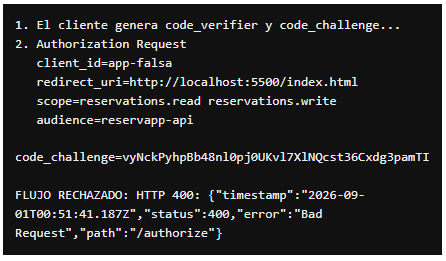
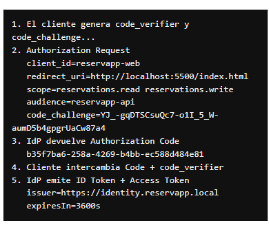
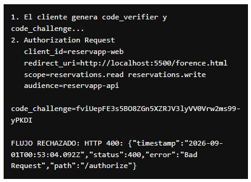
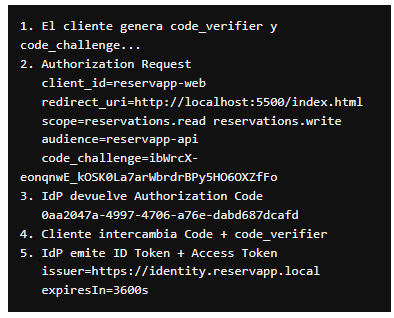

# App Registration Design · ReservApp

## `reservapp-web`

```text
Rol: Client
Tipo: público
Client ID: reservapp-web
Redirect URI: http://localhost:5500/index.html
Flujo: Authorization Code + PKCE
Scopes: reservations.read / reservations.write
Client secret: no
```

## `reservapp-api`

```text
Rol: Resource Server
Issuer esperado: https://identity.reservapp.local
Audience esperada: reservapp-api
Scopes: reservations.read / reservations.write
```

## Pruebas obligatorias

### Prueba 1 · Client ID no registrado

`client_id=app-falsa` → el IdP rechaza de inmediato, **antes** de emitir ningún código.

```json
HTTP 400 Bad Request
{"status":400,"error":"Bad Request","path":"/authorize"}
```

Falla en el paso 2 (Authorization Request), ni siquiera llega a mostrar login. El IdP no reconoce esa app.



### Prueba 2 · Restaurado

`client_id=reservapp-web` → flujo normal, completa hasta emitir ID Token + Access Token.



### Prueba 3 · Redirect URI no registrada

`redirect_uri=http://localhost:5500/florence.html` → el IdP rechaza otra vez de inmediato.

```json
HTTP 400 Bad Request
{"status":400,"error":"Bad Request","path":"/authorize"}
```

Mismo punto de falla: paso 2 (Authorization Request). El IdP valida la URI contra la lista registrada antes de continuar — así se evita que el código de autorización termine en un sitio no autorizado.



### Prueba 4 · Restaurada

`redirect_uri=http://localhost:5500/index.html` → flujo normal, completa hasta emitir tokens.



## Conclusión

Ambos errores (client_id y redirect_uri inválidos) se detectan **en el IdP, antes de llegar a la API**. No son 401/403 de `reservapp-api` — son un rechazo del Authorization Server al `/authorize`, porque la app o la URI no están en su registro. Esto confirma que la validación de "qué app puede pedir login" y "a dónde puede volver" es responsabilidad exclusiva del IdP, no del backend de negocio.
