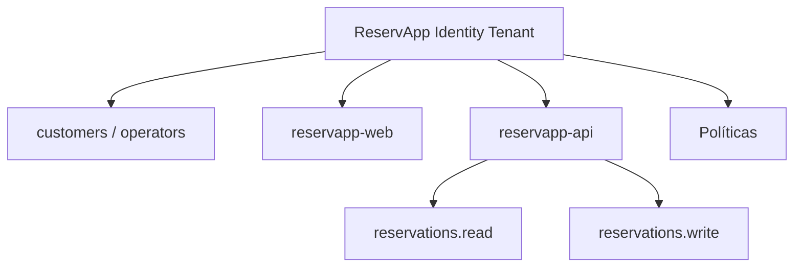

# Tenant Design · ReservApp

## ¿Qué está simulando `mock-identity`?

Está simulando un proveedor de identidad (IdP) real, tipo Auth0, Okta o Azure AD B2C. Hace el mismo trabajo: autentica usuarios y entrega tokens, pero de forma didáctica (tokens falsos, sin criptografía real).

## ¿Qué capacidades reales esperaríamos de un IDaaS?

- Tokens firmados con criptografía real (JWT + firma).
- MFA (segundo factor).
- Gestión de usuarios, contraseñas y recuperación de cuenta.
- Panel de administración para registrar apps, scopes y roles.
- Logs de auditoría y detección de fraude.
- Alta disponibilidad y cumplimiento (SOC2, GDPR, etc).

## ¿Por qué ReservApp se parece a un escenario CIAM?

Porque los usuarios (Ana, Bruno) son **clientes externos** de la reservadora, no empleados internos. CIAM (Customer IAM) está pensado justo para eso: gestionar identidades de clientes finales que consumen la app, a diferencia de IAM interno para empleados.

## ¿Un usuario del IdP debe ser la misma entidad que "Cliente" en la BD de ReservApp?

No necesariamente. El IdP solo garantiza "quién es" (identidad, vía `sub`). Que ese `sub` se relacione con un registro de "Cliente" en la base de datos de reservas es responsabilidad de la aplicación, son dos capas distintas que se conectan por el `sub`.

## ¿Qué significa que el tenant sea una frontera de confianza?

Significa que todo lo que pasa dentro del tenant (usuarios, apps registradas, políticas) comparte un mismo dominio de confianza y configuración. Nada de fuera del tenant puede autenticarse como si fuera de adentro, y las reglas (scopes, roles, apps permitidas) no se filtran a otros tenants. Es como una "casa" separada por cliente/organización.
