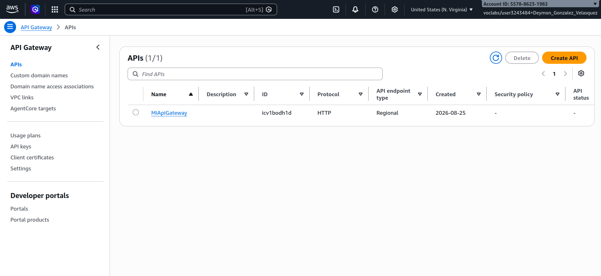
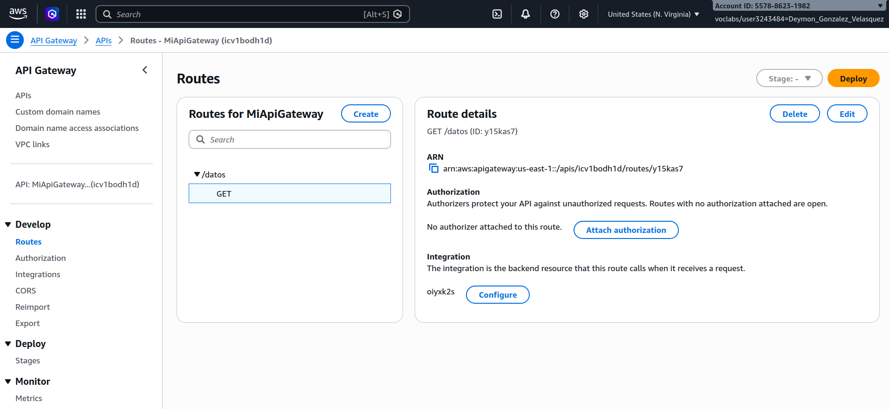
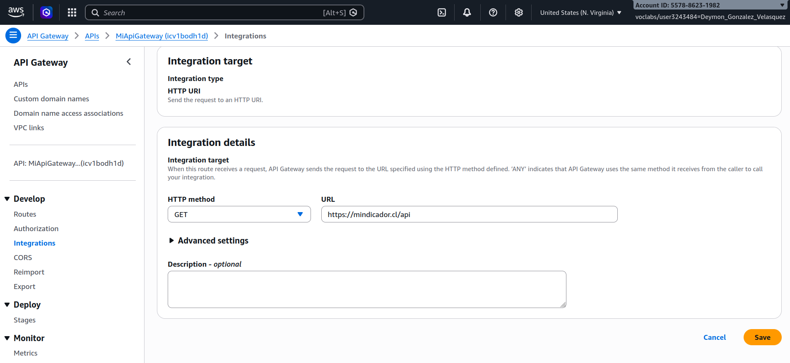
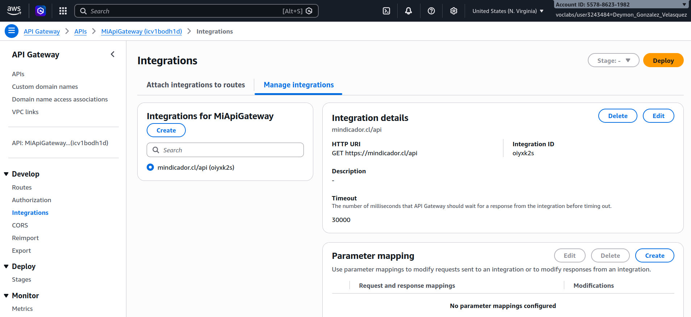
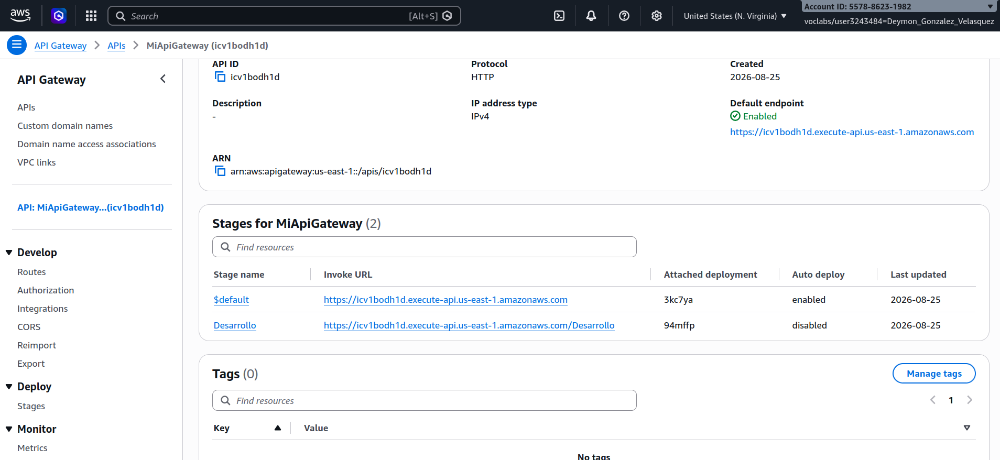
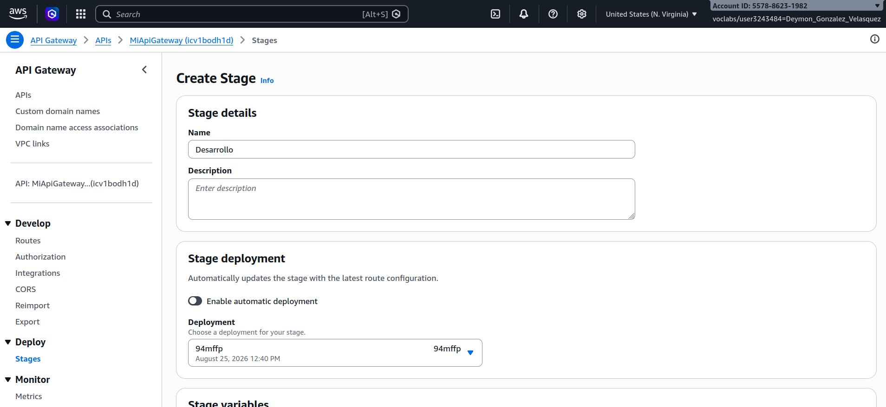
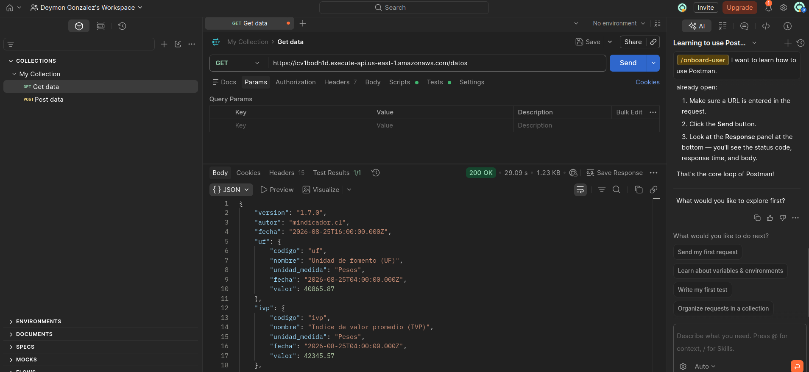
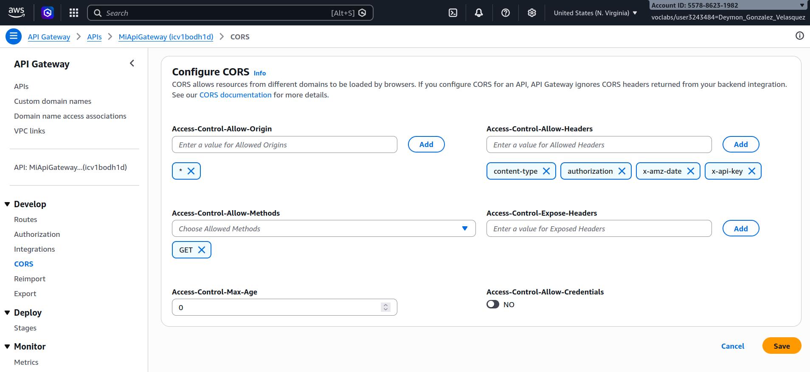

# Actividad 1.1.2 - Creando primer API Manager en AWS

### 1. Creación de API Gateway

Se crea un nuevo API Gateway en AWS.

### 2. Configuración de rutas

Se configura una ruta con método GET y endpoint `/datos`.

### 3. Asociar integración

Se asocia la integración apuntando a la API que se desea proteger.

### 4. Detalles de la integración

Se revisan los detalles de la integración configurada.

### 5. Detalles de la API Gateway creada

Se verifica la configuración completa de la API Gateway.

### 6. Creación de Stage para el deploy

Se crea un Stage para realizar el despliegue de la API.

### 7. Pruebas de la API implementada en Postman

Se prueba el endpoint de la API Gateway con el método GET

---

# Actividad 1.1.4 - Configurando CORS en el API Gateway

## Configuración de CORS

Se habilitan las configuraciones principales de CORS en la API Gateway para permitir el acceso desde el navegador.

